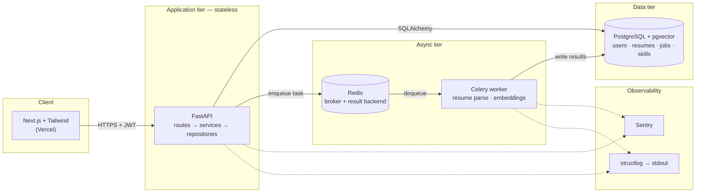

# CareerGraph

> Find out exactly which skills stand between you and the job you want — and the order to learn them in.

CareerGraph parses your resume, semantically matches it against real job descriptions, and then uses a
**skill-dependency graph** to compute the shortest learning path from what you know today to what the
target role requires.

**Status:** 🚧 Phase 0 — scaffolding. No feature code yet. See the [roadmap](#roadmap).

<!-- Badges are added in Phase 1, once CI exists.
[](https://github.com/Mazharul75/careergraph/actions/workflows/ci.yml)
-->

---

## The problem

A student looking at a "Backend Engineer" posting sees a wall of requirements and has no idea which
gaps actually matter, which ones are prerequisites for the others, or where to start. Comparing a
resume to a job description by hand is slow, and keyword-matching tools ("your resume contains the
word Docker: ✅") are close to useless — they can't tell that *Docker* is meaningful only once you
understand *Linux* and *networking basics*.

## What CareerGraph does

1. **Resume ingestion** — you upload a PDF/DOCX resume. An NLP pipeline extracts skills, experience,
   and education. This runs as a **background job**, so the upload request returns immediately.
2. **Semantic job matching** — you add job descriptions. Both your profile and each posting are turned
   into vector embeddings and compared by cosine similarity, so *"built REST services in Python"*
   matches *"experience with FastAPI/Flask"* even with zero shared keywords.
3. **Skill-gap pathfinding** — the differentiator. Skills live in a directed acyclic graph where an
   edge `A → B` means *"A is a prerequisite for B."* Given your current skills and a target job's
   required skills, we run a weighted shortest-path search to produce an **ordered** learning plan:
   *learn X, then Y, then Z* — not an unordered pile of missing keywords.
4. **Real accounts** — JWT auth with `job_seeker` and `recruiter` roles.

## Architecture



The API tier holds **no session state** — every request carries its own JWT — so it can be scaled to N
replicas behind a load balancer without sticky sessions. Anything slow (PDF parsing, embedding
generation) is pushed onto the Celery queue so no HTTP request ever waits on it.

Full write-up, including the request lifecycle and the layering rules: **[docs/architecture.md](docs/architecture.md)**

## Tech stack

| Layer | Choice | Why (short) |
|---|---|---|
| API | FastAPI (Python 3.12) | Async-native, Pydantic validation, OpenAPI docs for free |
| Database | PostgreSQL 16 + `pgvector` | One store for relational data *and* vector search |
| ORM / migrations | SQLAlchemy 2.0 + Alembic | Versioned, reviewable schema changes |
| Queue | Redis + Celery | Mature Python task queue; keeps the API non-blocking |
| Graph | NetworkX | In-process graph algorithms; no extra database to operate |
| Auth | JWT access + refresh, Argon2 hashing | Stateless auth that survives horizontal scaling |
| Frontend | Next.js (App Router) + Tailwind | SSR-capable React with a fast styling path |
| Local infra | Docker Compose | One command brings up API, worker, Postgres, Redis |
| CI/CD | GitHub Actions | Lint + test on every push, deploy on merge to `main` |
| Hosting | Render (API + worker), Neon (Postgres), Vercel (frontend) | Free tiers, managed Postgres with `pgvector` support |
| Testing | pytest + FastAPI `TestClient` | Fast, and runs the real ASGI app |
| Observability | structlog, Sentry, `/health` | Structured logs, error tracking, liveness probe |

Each of these — and the alternatives rejected — is justified in
**[ADR 0002](docs/adr/0002-technology-stack-selection.md)**.

## Repository layout

```
careergraph/
├── backend/
│   ├── app/
│   │   ├── api/v1/        # HTTP layer only: parse, authorize, delegate
│   │   ├── core/          # config, security primitives, logging setup
│   │   ├── db/            # engine, session lifecycle, declarative base
│   │   ├── models/        # SQLAlchemy ORM models (the tables)
│   │   ├── repositories/  # all database access lives here, nowhere else
│   │   ├── schemas/       # Pydantic request/response contracts
│   │   ├── services/      # business logic; knows nothing about HTTP
│   │   └── workers/       # Celery app + task definitions
│   └── tests/
│       ├── unit/          # services and graph logic, no I/O
│       └── integration/   # real DB, real HTTP via TestClient
├── frontend/              # Next.js app (Phase 4)
├── infra/                 # Dockerfiles, docker-compose, deploy config
├── docs/
│   ├── PRD.md             # what we're building and why
│   ├── architecture.md    # how it's put together
│   ├── CHECKLIST.md       # engineering requirements, tracked per phase
│   └── adr/               # architecture decision records
└── .github/workflows/     # CI/CD pipelines (Phase 1)
```

## Getting started

**Prerequisites:** [Docker Desktop](https://www.docker.com/products/docker-desktop/) (WSL2
backend on Windows) and [uv](https://docs.astral.sh/uv/). Python itself is not required on the
host — uv fetches its own.

```bash
git clone https://github.com/Mazharul75/careergraph.git && cd careergraph
```

```bash
cp .env.example .env
```

```bash
docker compose up
```

That brings up Postgres (with `pgvector`), Redis, and the API, applies migrations, and serves:

| URL | What |
|---|---|
| http://localhost:8000/docs | Swagger UI |
| http://localhost:8000/health | Liveness probe |
| http://localhost:8000/health/ready | Readiness probe (checks Postgres) |

> **Ports:** Postgres is published on host port **5433** and Redis on **6380**, not their
> defaults. A natively installed PostgreSQL usually already owns 5432, and the collision
> surfaces as a misleading "password authentication failed". Override with `POSTGRES_HOST_PORT`
> and `REDIS_HOST_PORT` in `.env` if those clash too.

### Running tests

Tests run on the host against the containerised database, so only `db` needs to be up:

```bash
docker compose up -d db
```

```bash
cd backend && uv sync --all-groups
```

```bash
uv run pytest
```

### The rest of the CI gate

```bash
uv run ruff check . && uv run ruff format --check . && uv run mypy app
```

### Migrations

```bash
uv run alembic upgrade head
```

```bash
uv run alembic revision --autogenerate -m "describe the change"
```

Schema conventions and the target ERD: **[docs/database.md](docs/database.md)**.

## Development workflow

Feature branches → pull request → CI must pass → merge to `main`. Commit messages follow
[Conventional Commits](https://www.conventionalcommits.org/). Details in
**[CONTRIBUTING.md](CONTRIBUTING.md)**.

## Roadmap

| Phase | Scope | Status |
|---|---|---|
| 0 | Repo scaffolding, PRD, ADRs, branching strategy | ✅ Done |
| 1a | Schema + migrations, layered skeleton, health probes, Docker, tests, CI | ✅ Done |
| 1b | JWT auth (register/login/refresh), roles, first live deploy | ⬜ Next |
| 2 | Resume upload + NLP parsing, embeddings, pgvector matching, Celery pipeline | ⬜ |
| 3 | NetworkX skill-dependency graph + shortest-path recommendations | ⬜ |
| 4 | Next.js dashboard: auth, match cards, skill-gap radar, learning-path view | ⬜ |
| 5 | Rate limiting, input-validation pass, secrets audit, dependency scanning | ⬜ |
| 6 | structlog, Sentry, health checks, CD pipeline, public deployment | ⬜ |
| 7 | Docs polish, load test, demo script | ⬜ |

## Documentation

- [Product requirements](docs/PRD.md) — the problem, users, scope, and success criteria
- [Architecture](docs/architecture.md) — layering, request lifecycle, async design
- [Database design](docs/database.md) — ERD, normalization notes, migration conventions
- [Engineering checklist](docs/CHECKLIST.md) — the standards this project holds itself to
- [Architecture Decision Records](docs/adr/) — why each significant choice was made
- [Contributing](CONTRIBUTING.md) — branching model and commit conventions

## License

[MIT](LICENSE) © MD Mazharul Islam Nabil
