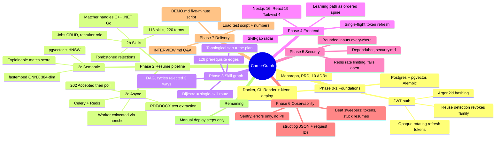

# Project state

> **This is the handoff document.** Read it before your first reply in any session; update it
> before writing any phase wrap-up. If it is stale, the next session starts blind.

**Last updated:** Phase 8a (career goals backend), 2026-08-16
**Branch:** `feat/skill-extraction` — **385 tests passing**
**Deployed:** API at `https://careergraph-api-f9n2.onrender.com`, frontend at
`https://careergraph-fawn.vercel.app`. CD is green.

**Why there are phases after 7.** The engineering was complete; the *product* was not. Using
the deployed app surfaced three real gaps, all confirmed against the code:

1. **The recruiter role is a dead end.** No candidate-ranking endpoint exists — `models/job.py`
   still says "candidate-ranking target in Phase 2c". A recruiter can post a job and see only a
   match score against *their own* skills, which is meaningless.
2. **Four authenticated pages**, and the loop never closes: the app produced a *report*, not a
   journey. Nothing a user did could change any number, so there was no reason to return.
3. **No admin role exists at all** — `UserRole` is `job_seeker | recruiter`.

**Next:** Phase 8b (journey-loop UI), then 9 (recruiter candidate ranking), 10 (admin role +
dashboard), 11 (depth pages + UX pass).

---

## 1. The system at a glance



**What it does, in one line:** parses a resume, scores it against a job description using skill
coverage plus semantic similarity, then returns an **ordered** learning plan computed by
topological sort over a prerequisite DAG.

**The differentiator, demonstrated:** a posting saying only *"run our production Kubernetes
clusters"* yields `Linux → Docker → Networking → Kubernetes`. None of the first three appear in
the job text. That is `nx.ancestors()` over the graph, and no keyword matcher can produce it.

---

## 2. Phase status

| Phase | Scope | Status |
|---|---|---|
| 0 | Repo, PRD, ADRs, branching strategy | ✅ merged |
| 1a | Schema, migrations, layered skeleton, health probes, Docker, CI | ✅ merged (PR #1, #2) |
| 1b | JWT auth, roles, CD workflow, Render deploy | ✅ merged (PR #4) |
| 2a | Celery + Redis, resume upload, text extraction | ✅ merged (PR #5) |
| 2b | Skill vocabulary, extraction, profile, jobs CRUD | ✅ merged (PR #6) |
| 2c | fastembed embeddings, pgvector, match scoring | ✅ committed on `feat/skill-extraction` |
| 3 | Skill graph DAG, learning paths | ✅ committed on `feat/skill-extraction` |
| 4 | Next.js frontend | ✅ committed on `feat/skill-extraction` |
| 5 | Rate limiting (ADR-0011), validation pass, secrets audit, Dependabot, security.md | ✅ committed on `feat/skill-extraction` |
| 6 | structlog + request IDs, Sentry, beat sweepers, CD sanity | ✅ committed on `feat/skill-extraction` |
| 7 | README/roadmap polish, load test, DEMO.md, INTERVIEW.md | ✅ committed on `feat/skill-extraction` |

### Requirements checklist (his 16)

✅ 1 architecture · 2 layering · 3 design patterns · 4 stateless+workers · 5 DB design ·
6 auth · 7 OpenAPI · 8 git workflow · 9 tests · 10 CI · **13 security** · **14 monitoring** ·
15 docs · 16 UI

🟡 **11 CD** and **12 live deploy** — code complete and verified; blocked only on the manual
steps in §6 (secrets + blueprint apply).

---

## 3. What exists

**Backend** — 70 Python modules, 7 reversible migrations, **356 tests** (unit run with no
database; integration need Postgres).

| Area | Files |
|---|---|
| Auth | `core/security.py`, `services/auth.py`, `api/v1/auth.py`, `models/{user,refresh_token}.py` |
| Resumes | `services/extraction.py`, `services/resume.py`, `workers/tasks.py`, `api/v1/resumes.py` |
| Skills | `data/skills_seed.py`, `services/skill_matching.py`, `services/skill_profile.py` |
| Jobs | `services/job.py`, `repositories/job.py`, `api/v1/jobs.py` |
| Matching | `services/embedding.py`, `services/matching.py`, `services/match.py` |
| Graph | `data/skill_edges_seed.py`, `services/skill_graph.py`, `services/learning_path.py` |
| Security | `core/rate_limit.py` (Redis fixed window), `api/rate_limit.py` (dependency), `docs/security.md` |
| Observability | `core/logging.py` (structlog), `api/middleware.py` (request IDs), Sentry init in `main.py` |
| Maintenance | `workers/maintenance.py` — beat-scheduled token purge + stuck-resume requeue |
| Delivery | `scripts/load_test.py`, `docs/DEMO.md`, `docs/INTERVIEW.md` |
| Goals (Phase 8a) | `models/career_goal.py`, `repositories/career_goal.py`, `services/goal.py`, `api/v1/goals.py`, migration `0008` |

**API surface**

```
GET    /health                              liveness
GET    /health/ready                        ready | degraded | unavailable
POST   /api/v1/auth/{register,login,refresh,logout}
GET    /api/v1/auth/me
POST   /api/v1/resumes                      202 + poll
GET    /api/v1/resumes[/{id}[/text]]
GET    /api/v1/skills                       113-skill vocabulary (public)
GET    /api/v1/skills/me                    confirmed + suggested
POST   /api/v1/skills/me                    add manually
PATCH  /api/v1/skills/me/{skill_id}         confirm | reject | rate
POST   /api/v1/skills/me/confirm-all
POST   /api/v1/jobs                         201, recruiter-only for is_public
GET    /api/v1/jobs[/{id}]
PATCH  /api/v1/jobs/{id}   DELETE /api/v1/jobs/{id}
GET    /api/v1/jobs/{id}/match              explainable score
GET    /api/v1/jobs/{id}/learning-path      ordered plan
GET    /api/v1/skills/{id}/learning-path    plan + cheapest route
```

**Frontend** — 19 TS/TSX files, 8 routes, builds clean. Landing, login, register, dashboard
(resume upload + live status), skills review, jobs list/create, job detail (score, radar,
breakdown, learning path).

---

## 4. Decisions — the 10 ADRs

Read `docs/adr/README.md` before proposing anything that contradicts one. ADRs are **immutable**;
a change of mind means a new ADR superseding the old.

| # | Decision | The thing to remember |
|---|---|---|
| 0001 | Record ADRs | Written with the code, not reconstructed later |
| 0002 | Stack | pgvector over a vector DB (no two-store consistency problem); NetworkX over Neo4j |
| 0003 | Monorepo | Path-filtered CI |
| 0004 | Trunk-based + PRs | `main` protected, merge commits only, CI is a **required** check |
| 0005 | Async SQLAlchemy + sync worker | Celery has no event loop; lazy loading is effectively banned |
| 0006 | uv | Lockfile reproducibility, fast Docker builds |
| 0007 | Opaque rotating refresh tokens | Reuse ⇒ revoke whole family. Cookies rejected: Vercel↔Render is cross-domain |
| 0008 | Colocated Celery worker | Render's free tier has **no** Background Workers; $7/mo is the documented upgrade |
| 0009 | fastembed ONNX | Measured **200 MB** peak; never import at module scope; recycle child per task |
| 0010 | Skill graph as DAG | Topological sort, not shortest path — a plan is not a path |
| 0011 | Hand-rolled Redis rate limiting | ~40 lines beats a dependency; fixed window; **fails open** when Redis is down — availability of login over strictness, the outage surfaces via `/health/ready` |
| 0012 | Embedding as its own task | Commit the valuable work *before* the process-fatal work. `try/except` cannot catch an OOM kill |
| 0013 | Career goals + the `learning` state | A report has no memory, so nothing a user does can pay off. Freezing a baseline score adds the time axis. `learning` deliberately does **not** count toward the score — only completion moves it |

---

## 5. Gotchas — read before debugging anything

These all cost real time. Most were invisible locally and only real in CI or production.

### Async SQLAlchemy
- **`lazy="joined"` applies to queries, not to objects built in Python.** A freshly constructed
  entity has no relationship loaded; serialising it raises `MissingGreenlet`. Re-read via the
  repository with `populate_existing=True` — without that flag the identity map returns the same
  unloaded instance and the eager option is silently ignored.
- **Assigning a collection on a persistent object triggers a lazy load** (to compute the
  delete-orphan delta). Use explicit `DELETE` + `add_all` instead.
- Both pytest-asyncio loop scopes must be `session`, or asyncpg connections cross event loops.

### Things only CI can catch
- **`.gitignore` swallowing source.** An unanchored `data/` matched `backend/app/data/` at any
  depth. Tests passed (they read disk, not git); the production migration would have died with
  `ModuleNotFoundError`. Anchor patterns with `/`.
- **Incomplete `git add`.** Three separate failures. Always end with `git status --short`.
- **Env leaking into unit tests.** `Settings(_env_file=None)` still reads the process
  environment; CI's `ENVIRONMENT=ci` broke a default-value assertion. `tests/unit/conftest.py`
  now derives the strip-list from `Settings.model_fields` so it cannot drift.
- **Test doubles drifting from Protocols.** `mypy app tests` — not just `app`.

### Deployment
- `sh -c "a && b"` in `render.yaml` gets parsed twice → **exit 127**. Use a single bare token:
  `dockerCommand: /app/start.sh`.
- `exec` in `start.sh` so honcho is PID 1 and gets SIGTERM (verified: 8.3 s graceful stop).
- `chmod +x` in the Dockerfile — Windows has no POSIX permission bits.
- `.gitattributes` pins `*.sh` to LF, preventing `bad interpreter: /bin/sh^M`.
- Buildx `setup-buildx-action` is required for `cache-to: type=gha`.

### Data quality — validity ≠ usefulness
Two prerequisite edges produced a **perfectly valid DAG** giving absurd advice: `embeddings →
pgvector` made a Postgres extension require deep learning (12-step plan), and `networking →
linux` was backwards. No validity check catches this. A test now asserts common targets stay
within six steps from scratch.

### Frontend
- Refresh tokens are single-use; concurrent 401s each calling `/auth/refresh` would trip the
  backend's own reuse detection and sign the user out. `api.ts` uses a **single-flight** guard.
- eslint-config-next v16 ships flat configs — `FlatCompat` crashes.

### The first real production failure (2026-08-16) — read this one
The first live resume upload hung forever. Four separate things had to be true, and the
combination is worth understanding because each part looked correct on its own.

1. **The worker was OOM-killed loading the embedding model.** 512 MB holds the API (~150 MB)
   plus the worker (~100 MB); the ~200 MB model does not fit on top. Diagnostic signature:
   Celery's `[tasks]` banner (`. resumes.parse`) prints **only at worker startup**, so seeing
   it a second time means the worker restarted. Task received 13:37:43, banner again 13:38:38,
   no `succeeded` line — killed 55 s in, well under the 120 s soft timeout, so not a timeout.
2. **An OOM kill is not catchable.** `embed_text` was wrapped in `try/except` to make it best
   effort, but the process is killed outright — the `except` never runs, and the whole parse
   dies with it. *Wrapping something in try/except does not make it best-effort if the failure
   mode is the process dying.*
3. **Redis does not redeliver for an hour.** Redis has no native ack, so `task_acks_late` is
   emulated with a **visibility timeout, default 3600 s**. A killed worker's message stays
   invisible for an hour — indistinguishable from a permanent hang. Now set to 600 s, which
   must stay above the 180 s hard time limit or a running task gets executed twice.
4. **The sweeper walked straight past it.** `requeue_stuck_resumes` only looked at `pending`,
   but `parse_resume` sets `processing` and commits *before* the heavy work. The exact failure
   it was built to repair, in the one state it did not check. Now covers both.

**The fix (ADR-0012):** embedding moved into its own `resumes.embed` task, enqueued only after
the parse transaction commits. The resume reaches `complete` with text and skills before the
memory-hungry step is even scheduled, so an OOM there costs only the vector. Verified live:
parse 1.29 s, embed 18.4 s separately, final row `complete | text | vector | bytes dropped`.

**Also corrected:** `--max-tasks-per-child` was 10 in `Procfile` and `render.yaml` while
`config.py` said 1 and cited ADR-0009's reasoning for it. The CLI flag wins, so production
held the 200 MB model across ten tasks. Now 1 everywhere. *A setting documented in one place
and overridden in another is worse than either value.*

### Observability & workers (Phase 6)
- **Another compose project can steal port 5433.** Integration tests suddenly failed with
  `password authentication failed for user "careergraph"` — a *different* project's Postgres
  container (learn2earn) was listening on 5433 and ours was down. A password error can mean
  "right port, wrong database entirely"; check `docker ps` before checking credentials.
- **Celery silently hijacks the root logger.** Connecting *any* receiver to the
  `setup_logging` signal disables that — which is the only reason the worker's JSON logging
  survives. Delete that receiver and production logs quietly revert to Celery's format.
- **Embedded beat writes a schedule file.** Default location is the CWD, which the container
  user cannot write; `beat_schedule_filename` points at `/tmp`. Symptom otherwise: worker
  boots, beat dies, sweepers never fire, nothing looks broken.
- **`resumes.size_bytes` has a `> 0` check constraint.** A test manufacturing a row with
  `file_data=None` must still claim a positive size.
- Embedded beat (`-B`) is correct **only with one worker instance** — each instance would fire
  every schedule. Scaling workers means a dedicated beat process first.

---

## 6. Outstanding manual steps — CD is red because of these

All four production deployments have failed. Diagnosis (verified by reproducing Render's exact
environment locally): **the app boots fine**; the workflow exits on its own guard.

1. **`RENDER_DEPLOY_HOOK_URL` secret is not set.** Render → service → Settings → Deploy Hook →
   copy. GitHub → Settings → Secrets and variables → Actions → new secret with that name.
   *Confirm first:* open a failed run → `Deploy API to Render` → first step should read
   `RENDER_DEPLOY_HOOK_URL secret is not set`.
2. **`REDIS_URL` is not set on Render.** Create a free **Key Value** instance, paste its internal
   connection string. Without it uploads are accepted and never processed —
   `/health/ready` now reports `degraded` instead of lying about it.
3. **Hostname confirmed.** The real service URL is `https://careergraph-api-f9n2.onrender.com`
   (Render appended `-f9n2` because the bare name was taken); `cd.yml` polls it.
4. **Vercel** — not yet deployed. Needs `NEXT_PUBLIC_API_URL`, and the Render `CORS_ORIGINS` must
   then be set to the Vercel URL.
5. **`SENTRY_DSN` (optional).** Create a free Sentry project, paste the DSN into the Render
   environment. Leaving it blank is valid — the app treats blank as "Sentry off".

---

## 7. Known gaps, deliberately deferred

Closed this cycle: rate limiting (Phase 5), Dependabot (Phase 5), structured logging + error
tracking (Phase 6), refresh-token growth (purge sweeper), stuck-`pending` resumes (requeue
sweeper).

| Gap | Why acceptable | When |
|---|---|---|
| **No frontend tests at all** | Flagged honestly rather than skipped quietly | Post-v1; Playwright E2E is the right first test |
| Free-tier memory is marginal | 200 MB model + 150 MB API on 512 MB; mitigated by per-task child recycling | $7/mo Render worker if it OOMs |
| Registration reveals whether an address is taken | Alternative needs email delivery | Documented in ADR-0007 |
| Graph is rebuilt per request | 2 queries, ~130 edges, few ms | Cache when measured |
| Per-IP rate limits are weak behind shared NATs | Campus/office NAT shares one IP; limits are set generously | Per-account limits if it bites |
| Load test is smoke-level (single host, GETs only) | Answers "does it fall over", not "what is capacity" | Locust/k6 if capacity planning ever matters |

---

## 8. Update protocol

At the end of each phase, **before** writing the wrap-up:

1. Update §2 phase status and the checklist.
2. Add anything new to §3 (files, routes).
3. Add any new ADR to §4.
4. Add every new gotcha to §5 — **this section is the most valuable part of this file.**
5. Update §6 if manual steps changed, §7 if a gap opened or closed.
6. Change the header: last-updated, branch, test count, next phase.

Then commit it with the phase.
