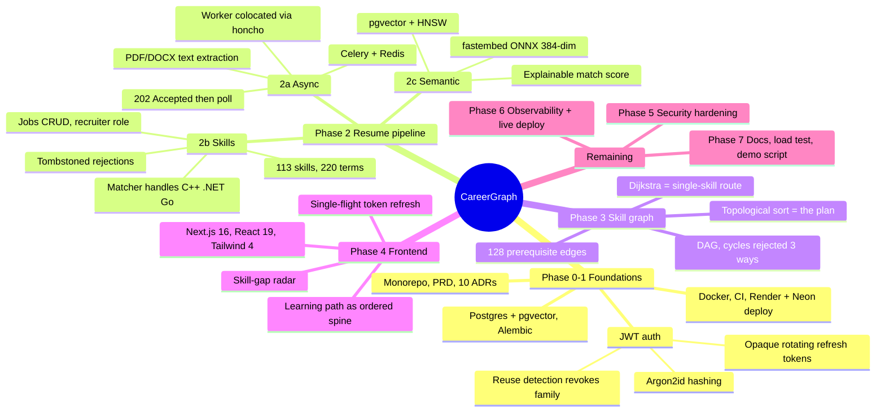

# Project state

> **This is the handoff document.** Read it before your first reply in any session; update it
> before writing any phase wrap-up. If it is stale, the next session starts blind.

**Last updated:** end of Phase 4 (frontend), 2026-08-15
**Branch:** `feat/skill-extraction` — working tree clean, 333 tests passing
**Next:** Phase 5 — rate limiting, input-validation pass, secrets audit, Dependabot, security write-up

---

## 1. The system at a glance



**What it does, in one line:** parses a resume, scores it against a job description using skill
coverage plus semantic similarity, then returns an **ordered** learning plan computed by
topological sort over a prerequisite DAG.

**The differentiator, demonstrated:** a posting saying only *"run our production Kubernetes
clusters"* yields `Linux → Docker → Networking → Kubernetes`. None of the first three appear in
the job text. That is `nx.ancestors()` over the graph, and no keyword matcher can produce it.

---

## 2. Phase status

| Phase | Scope | Status |
|---|---|---|
| 0 | Repo, PRD, ADRs, branching strategy | ✅ merged |
| 1a | Schema, migrations, layered skeleton, health probes, Docker, CI | ✅ merged (PR #1, #2) |
| 1b | JWT auth, roles, CD workflow, Render deploy | ✅ merged (PR #4) |
| 2a | Celery + Redis, resume upload, text extraction | ✅ merged (PR #5) |
| 2b | Skill vocabulary, extraction, profile, jobs CRUD | ✅ merged (PR #6) |
| 2c | fastembed embeddings, pgvector, match scoring | ✅ committed on `feat/skill-extraction` |
| 3 | Skill graph DAG, learning paths | ✅ committed on `feat/skill-extraction` |
| 4 | Next.js frontend | ✅ committed on `feat/skill-extraction` |
| **5** | **Rate limiting, validation pass, secrets audit, Dependabot** | ⬜ **next** |
| 6 | structlog, Sentry, CD green, live deploy | ⬜ |
| 7 | Docs polish, load test, demo script, interview prep | ⬜ |

### Requirements checklist (his 16)

✅ 1 architecture · 2 layering · 3 design patterns · 4 stateless+workers · 5 DB design ·
6 auth · 7 OpenAPI · 8 git workflow · 9 tests · 10 CI · 15 docs · **16 UI**

🟡 **11 CD** and **12 live deploy** — blocked on manual steps (§6)
🟡 **13 security** — rate limiting + Dependabot = Phase 5
🟡 **14 monitoring** — structlog + Sentry = Phase 6

---

## 3. What exists

**Backend** — 65 Python modules, 7 reversible migrations, **333 tests** (unit run with no
database; integration need Postgres).

| Area | Files |
|---|---|
| Auth | `core/security.py`, `services/auth.py`, `api/v1/auth.py`, `models/{user,refresh_token}.py` |
| Resumes | `services/extraction.py`, `services/resume.py`, `workers/tasks.py`, `api/v1/resumes.py` |
| Skills | `data/skills_seed.py`, `services/skill_matching.py`, `services/skill_profile.py` |
| Jobs | `services/job.py`, `repositories/job.py`, `api/v1/jobs.py` |
| Matching | `services/embedding.py`, `services/matching.py`, `services/match.py` |
| Graph | `data/skill_edges_seed.py`, `services/skill_graph.py`, `services/learning_path.py` |

**API surface**

```
GET    /health                              liveness
GET    /health/ready                        ready | degraded | unavailable
POST   /api/v1/auth/{register,login,refresh,logout}
GET    /api/v1/auth/me
POST   /api/v1/resumes                      202 + poll
GET    /api/v1/resumes[/{id}[/text]]
GET    /api/v1/skills                       113-skill vocabulary (public)
GET    /api/v1/skills/me                    confirmed + suggested
POST   /api/v1/skills/me                    add manually
PATCH  /api/v1/skills/me/{skill_id}         confirm | reject | rate
POST   /api/v1/skills/me/confirm-all
POST   /api/v1/jobs                         201, recruiter-only for is_public
GET    /api/v1/jobs[/{id}]
PATCH  /api/v1/jobs/{id}   DELETE /api/v1/jobs/{id}
GET    /api/v1/jobs/{id}/match              explainable score
GET    /api/v1/jobs/{id}/learning-path      ordered plan
GET    /api/v1/skills/{id}/learning-path    plan + cheapest route
```

**Frontend** — 19 TS/TSX files, 8 routes, builds clean. Landing, login, register, dashboard
(resume upload + live status), skills review, jobs list/create, job detail (score, radar,
breakdown, learning path).

---

## 4. Decisions — the 10 ADRs

Read `docs/adr/README.md` before proposing anything that contradicts one. ADRs are **immutable**;
a change of mind means a new ADR superseding the old.

| # | Decision | The thing to remember |
|---|---|---|
| 0001 | Record ADRs | Written with the code, not reconstructed later |
| 0002 | Stack | pgvector over a vector DB (no two-store consistency problem); NetworkX over Neo4j |
| 0003 | Monorepo | Path-filtered CI |
| 0004 | Trunk-based + PRs | `main` protected, merge commits only, CI is a **required** check |
| 0005 | Async SQLAlchemy + sync worker | Celery has no event loop; lazy loading is effectively banned |
| 0006 | uv | Lockfile reproducibility, fast Docker builds |
| 0007 | Opaque rotating refresh tokens | Reuse ⇒ revoke whole family. Cookies rejected: Vercel↔Render is cross-domain |
| 0008 | Colocated Celery worker | Render's free tier has **no** Background Workers; $7/mo is the documented upgrade |
| 0009 | fastembed ONNX | Measured **200 MB** peak; never import at module scope; recycle child per task |
| 0010 | Skill graph as DAG | Topological sort, not shortest path — a plan is not a path |

---

## 5. Gotchas — read before debugging anything

These all cost real time. Most were invisible locally and only real in CI or production.

### Async SQLAlchemy
- **`lazy="joined"` applies to queries, not to objects built in Python.** A freshly constructed
  entity has no relationship loaded; serialising it raises `MissingGreenlet`. Re-read via the
  repository with `populate_existing=True` — without that flag the identity map returns the same
  unloaded instance and the eager option is silently ignored.
- **Assigning a collection on a persistent object triggers a lazy load** (to compute the
  delete-orphan delta). Use explicit `DELETE` + `add_all` instead.
- Both pytest-asyncio loop scopes must be `session`, or asyncpg connections cross event loops.

### Things only CI can catch
- **`.gitignore` swallowing source.** An unanchored `data/` matched `backend/app/data/` at any
  depth. Tests passed (they read disk, not git); the production migration would have died with
  `ModuleNotFoundError`. Anchor patterns with `/`.
- **Incomplete `git add`.** Three separate failures. Always end with `git status --short`.
- **Env leaking into unit tests.** `Settings(_env_file=None)` still reads the process
  environment; CI's `ENVIRONMENT=ci` broke a default-value assertion. `tests/unit/conftest.py`
  now derives the strip-list from `Settings.model_fields` so it cannot drift.
- **Test doubles drifting from Protocols.** `mypy app tests` — not just `app`.

### Deployment
- `sh -c "a && b"` in `render.yaml` gets parsed twice → **exit 127**. Use a single bare token:
  `dockerCommand: /app/start.sh`.
- `exec` in `start.sh` so honcho is PID 1 and gets SIGTERM (verified: 8.3 s graceful stop).
- `chmod +x` in the Dockerfile — Windows has no POSIX permission bits.
- `.gitattributes` pins `*.sh` to LF, preventing `bad interpreter: /bin/sh^M`.
- Buildx `setup-buildx-action` is required for `cache-to: type=gha`.

### Data quality — validity ≠ usefulness
Two prerequisite edges produced a **perfectly valid DAG** giving absurd advice: `embeddings →
pgvector` made a Postgres extension require deep learning (12-step plan), and `networking →
linux` was backwards. No validity check catches this. A test now asserts common targets stay
within six steps from scratch.

### Frontend
- Refresh tokens are single-use; concurrent 401s each calling `/auth/refresh` would trip the
  backend's own reuse detection and sign the user out. `api.ts` uses a **single-flight** guard.
- eslint-config-next v16 ships flat configs — `FlatCompat` crashes.

---

## 6. Outstanding manual steps — CD is red because of these

All four production deployments have failed. Diagnosis (verified by reproducing Render's exact
environment locally): **the app boots fine**; the workflow exits on its own guard.

1. **`RENDER_DEPLOY_HOOK_URL` secret is not set.** Render → service → Settings → Deploy Hook →
   copy. GitHub → Settings → Secrets and variables → Actions → new secret with that name.
   *Confirm first:* open a failed run → `Deploy API to Render` → first step should read
   `RENDER_DEPLOY_HOOK_URL secret is not set`.
2. **`REDIS_URL` is not set on Render.** Create a free **Key Value** instance, paste its internal
   connection string. Without it uploads are accepted and never processed —
   `/health/ready` now reports `degraded` instead of lying about it.
3. **Check the hostname.** CD polls `https://careergraph-api.onrender.com/health`; if the service
   name differs, update `cd.yml` and `render.yaml`.
4. **Vercel** — not yet deployed. Needs `NEXT_PUBLIC_API_URL`, and the Render `CORS_ORIGINS` must
   then be set to the Vercel URL.

---

## 7. Known gaps, deliberately deferred

| Gap | Why acceptable | When |
|---|---|---|
| No rate limiting on `/auth/login` | Argon2 costs ~50 ms, but that is not a control | **Phase 5** |
| No Dependabot / dependency scanning | — | **Phase 5** |
| **No frontend tests at all** | Flagged honestly rather than skipped quietly | Phase 5 or 7 |
| No structured logging or error tracking | `/health` + `/health/ready` only | Phase 6 |
| `refresh_tokens` grows without bound | Spent rows must persist for reuse detection | Phase 6 sweeper |
| Resume can stick in `pending` if the process dies between commit and enqueue | Recoverable; better than losing the upload | Phase 6 sweeper |
| Free-tier memory is marginal | 200 MB model + 150 MB API on 512 MB; mitigated by per-task child recycling | $7/mo Render worker if it OOMs |
| Registration reveals whether an address is taken | Alternative needs email delivery | Documented in ADR-0007 |
| Graph is rebuilt per request | 2 queries, ~130 edges, few ms | Cache when measured, Phase 6 |

---

## 8. Update protocol

At the end of each phase, **before** writing the wrap-up:

1. Update §2 phase status and the checklist.
2. Add anything new to §3 (files, routes).
3. Add any new ADR to §4.
4. Add every new gotcha to §5 — **this section is the most valuable part of this file.**
5. Update §6 if manual steps changed, §7 if a gap opened or closed.
6. Change the header: last-updated, branch, test count, next phase.

Then commit it with the phase.
