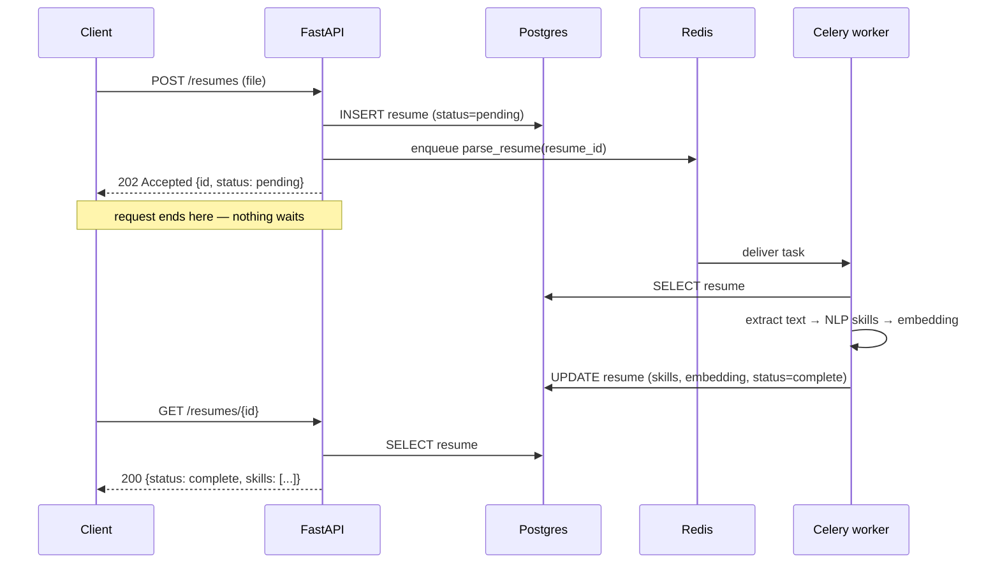
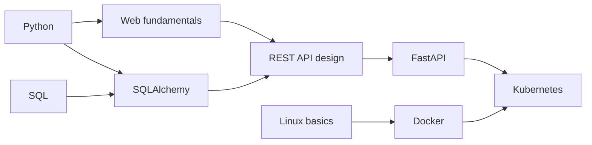

# CareerGraph — Architecture

This document explains how the system is put together and, more importantly, **why**. It is written
to be read by someone who has not seen the code.

---

## 1. Guiding constraints

Three constraints drive nearly every decision below.

1. **The API must be stateless.** No user session lives in the API process's memory. This is what
   allows the API to be scaled to N replicas, or restarted by the host at any moment, without anyone
   getting logged out. It is the reason we use JWTs rather than server-side sessions.
2. **No HTTP request may wait on slow work.** Parsing a PDF and generating embeddings takes seconds.
   A request that does that inline occupies a worker process, and under any real load the server
   collapses. Slow work goes on a queue.
3. **Business logic must be testable without HTTP or a database.** That's what forces the layering
   in section 2.

## 2. Layered structure

The backend is organised into four layers. **Dependencies point in one direction only** — downward.
A layer may call the layer below it and must never reach upward.

```
┌────────────────────────────────────────────────────────────┐
│  api/          HTTP layer                                  │
│                Parse the request, check authorization,     │
│                call a service, shape the response.         │
│                Knows about: HTTP, Pydantic schemas.        │
│                Knows nothing about: SQL, the ORM.          │
├────────────────────────────────────────────────────────────┤
│  services/     Business logic                              │
│                "What does it mean to score a resume        │
│                against a job?" Orchestrates repositories.  │
│                Knows about: domain rules, repositories.    │
│                Knows nothing about: Request, Response,     │
│                status codes, SQL.                          │
├────────────────────────────────────────────────────────────┤
│  repositories/ Data access                                 │
│                Every query in the system lives here.       │
│                Exposes intent-named methods                │
│                (get_by_email, list_for_user).              │
│                Knows about: SQLAlchemy, models.            │
├────────────────────────────────────────────────────────────┤
│  models/       Persistence schema (SQLAlchemy ORM)         │
└────────────────────────────────────────────────────────────┘
```

Supporting modules sit beside these rather than inside the stack:

- `core/` — configuration, password hashing, JWT encode/decode, logging setup.
- `schemas/` — Pydantic models defining the API's request and response contracts. These are
  deliberately **separate types** from the ORM models, so an accidental change to a database column
  can't silently change the public API shape (and so a `password_hash` column can never leak into a
  response).
- `db/` — engine creation and the request-scoped session lifecycle.
- `workers/` — the Celery application and task definitions. Tasks are thin: they call the same
  services the API calls.

### Why this and not "just put it in the route"

A FastAPI route that opens a session, runs a query, applies business rules, and returns a dict is
fast to write and impossible to test in isolation — you can only test it by making an HTTP request
against a live database. Splitting the layers means the interesting logic (scoring, pathfinding) is
plain Python that can be unit-tested in milliseconds with a fake repository.

### Design patterns used deliberately

**Repository pattern.** Services depend on a repository *interface*, not on SQLAlchemy. In tests we
substitute an in-memory implementation, so service tests need no database. The payoff is
concentration: if a query is slow or wrong, there is exactly one file to look in.

**Dependency injection via FastAPI `Depends`.** Routes declare what they need (`db: Session`,
`current_user: User`) and FastAPI supplies it. Nothing constructs its own dependencies, so tests
override them with `app.dependency_overrides` rather than monkey-patching globals.

Both are documented in their own ADRs when implemented in Phase 1.

## 3. Request lifecycle — a synchronous read

`GET /api/v1/jobs/{job_id}/match`

1. **Middleware** attaches a request ID and starts a structured log context.
2. **Dependency resolution** — `get_db` opens a session; `get_current_user` decodes the `Bearer`
   JWT, verifies signature and expiry, and loads the user. A bad token fails here with `401`,
   before any application code runs.
3. **Route handler** validates path/query params via Pydantic and calls
   `MatchService.score(user_id, job_id)`.
4. **Service** asks `ResumeRepository` for the user's skill profile and `JobRepository` for the job's
   embedding, runs the comparison, and returns a domain object.
5. **Route** serialises that into a `MatchResponse` schema. Fields not on the schema cannot leak.
6. **Session closes** in the dependency's teardown, on success or exception alike.

## 4. Asynchronous pipeline — a resume upload

`POST /api/v1/resumes` must return immediately, so the actual work is deferred:



The client polls (or, later, subscribes) for status. The important property: **API replicas and
worker replicas scale independently**. A backlog of resumes is fixed by adding workers, not by
making the API bigger.

Tasks must be **idempotent** — Celery may deliver the same task twice if a worker dies mid-run — so
every task is written to be safe to re-run.

## 5. The skill graph

The centrepiece. Skills are nodes; a directed edge `A → B` means *A is a prerequisite of B*.



The graph is a **DAG** — a cycle would mean "A requires B requires A", which is unlearnable, so cycle
detection is a hard validation rule on the seed data.

Given the user's known skills `K` and a target job's required skills `R`:

1. Compute the missing set `R \ K`.
2. For each missing skill, walk its ancestors to pull in prerequisites the user also lacks.
3. Produce a **topological ordering** of that induced subgraph, weighted by estimated learning
   effort, to get the recommended sequence.

Why a graph rather than a scored list: a list can only tell you *what* is missing. A graph tells you
*what order* to fix it in, which is the actual product. Full reasoning lands in Phase 3's ADR.

## 6. Data model (intended)

Detailed ERD and migrations come in Phase 1. The intended core entities:

- `users` — identity, `password_hash`, `role`
- `refresh_tokens` — rotation and revocation state
- `resumes` — file metadata, parse status, extracted text
- `skills` — canonical skill vocabulary
- `skill_edges` — prerequisite relationships (the graph)
- `user_skills` / `job_skills` — many-to-many join tables with proficiency/importance
- `jobs` — job descriptions, owner, `embedding vector(N)`
- `matches` — cached scores

## 7. Deployment topology

| Component | Host | Notes |
|---|---|---|
| Frontend | Vercel | Deploys on push; preview URL per PR |
| API | Render web service | Docker image built from `infra/` |
| Worker | Render background worker | Same image, different entrypoint |
| Postgres | Neon | Managed, `pgvector` available |
| Redis | Render Key Value / Upstash | Broker + result backend |

One image for API and worker means the code they run is provably identical.

## 8. Cross-cutting concerns

- **Configuration** — all settings come from environment variables via a single Pydantic `Settings`
  object. Nothing reads `os.environ` directly, so every knob is discoverable and typed.
- **Logging** — `structlog` emits JSON with a request ID on every line, so a single request can be
  traced across API and worker.
- **Errors** — Sentry captures unhandled exceptions from both API and worker.
- **Health** — `/health` reports process liveness plus database and Redis reachability.
- **Security** — Pydantic validates all input at the boundary; rate limiting protects auth
  endpoints; secrets live only in environment variables; Dependabot watches dependencies.

## 9. Rejected alternatives (summary)

| Considered | Rejected because |
|---|---|
| Neo4j for the skill graph | Operating a second database for a graph of a few hundred nodes is unjustified cost and complexity |
| A dedicated vector DB (Pinecone, Qdrant) | `pgvector` keeps vectors and relational data in one transactional store; no sync problem |
| Server-side sessions | Breaks statelessness and horizontal scaling |
| Django | Batteries-included ORM/admin, but weaker async story and less natural OpenAPI generation |
| Running parsing inline with `BackgroundTasks` | Dies with the process; no retries, no visibility, no independent scaling |
