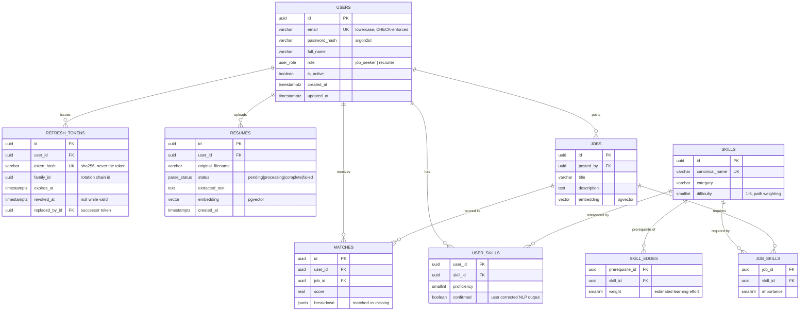

# Database design

PostgreSQL 16 with the `pgvector` extension. One store for relational data and embeddings — see
[ADR-0002](adr/0002-technology-stack-selection.md) for why.

---

## Target ERD

The full intended schema. Tables marked ⬜ are designed but not yet migrated; they arrive with
the feature that needs them, so every migration ships alongside working code rather than as one
speculative up-front dump.



| Table | Phase | Status |
|---|---|---|
| `users` | 1a | ✅ migrated |
| `refresh_tokens` | 1b | ✅ migrated |
| `resumes`, `skills`, `user_skills`, `jobs`, `job_skills`, `matches` | 2 | ⬜ |
| `skill_edges` | 3 | ⬜ |

## Normalization

The schema is in **third normal form**. The join tables are where that shows:

- A skill name is stored once, in `skills`. `user_skills` and `job_skills` reference it by ID.
  Storing skill names as text on each user would make "Postgres" and "PostgreSQL" separate
  skills and make renaming one an update across every row that mentions it.
- `skill_edges` is a pure many-to-many between skills, which is exactly what an edge list is.
  This table *is* the graph — NetworkX loads from it, it is not a second copy.
- `matches` is a deliberate, documented exception: `score` is derived data that could be
  recomputed from the two embeddings. It is cached because recomputation is expensive and the
  inputs are immutable once a resume is parsed.

## Conventions

**UUID primary keys, not serial integers.** Sequential IDs leak information — `/users/3` says
the system has almost no users, and `/users/4` is a guessable neighbour. UUIDs also let a
client generate an ID before the row exists.

**`timestamptz`, never naive timestamps.** Set by the database via `server_default=now()` and
`onupdate`, so values are correct even for rows written by a migration or by hand, and immune
to clock skew between application replicas.

**Explicit constraint naming.** `Base.metadata` carries a naming convention
(`app/db/base.py`). Without it PostgreSQL invents constraint names that differ between
databases, and Alembic ends up able to create a constraint it cannot later drop by name.

**Constraints in the database, not only in Python.** The `users.email` uniqueness and the
`email = lower(email)` CHECK are enforced by Postgres. An application-level check alone loses
to two concurrent registrations — both read "not taken", both insert.

**Soft deactivation over deletion.** `users.is_active` rather than `DELETE`. Hard-deleting a
user would cascade away their resumes and match history, unrecoverably.

## Migrations

Alembic, applied with `alembic upgrade head`. CI runs `upgrade head` → `downgrade base` →
`upgrade head` on every push, so a migration that cannot be reversed fails in review rather
than during an incident.

The `vector` extension is created by the **first migration**, not by a docker-compose init
script. Anything configured only in compose is a step someone must remember to repeat on Neon.

```bash
uv run alembic revision --autogenerate -m "add refresh tokens"
```

Always read generated migrations before committing. Autogenerate does not detect table or
column *renames* — it emits a drop plus an add, which silently destroys data.
